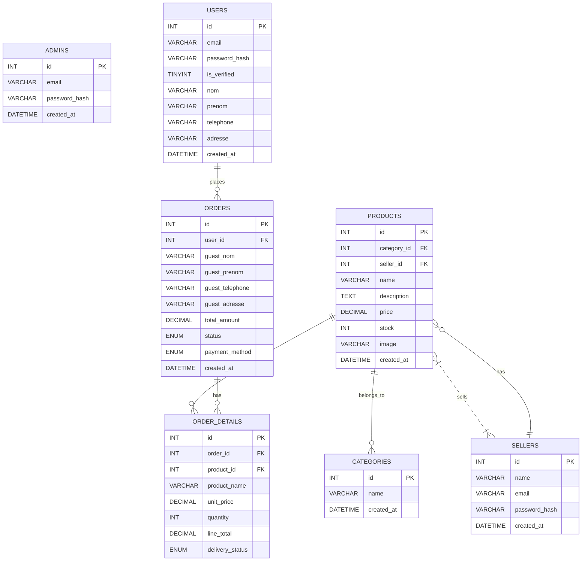

# ERD - Glow Store

```mermaid
erDiagram
    ADMINS {
        INT id PK
        VARCHAR email
        VARCHAR password_hash
        DATETIME created_at
    }

    CATEGORIES {
        INT id PK
        VARCHAR name
        DATETIME created_at
    }

    PRODUCTS {
        INT id PK
        INT category_id FK
        INT seller_id FK
        VARCHAR name
        TEXT description
        DECIMAL price
        INT stock
        VARCHAR image
        DATETIME created_at
    }

    SELLERS {
        INT id PK
        VARCHAR name
        VARCHAR email
        VARCHAR password_hash
        DATETIME created_at
    }

    USERS {
        INT id PK
        VARCHAR email
        VARCHAR password_hash
        TINYINT is_verified
        VARCHAR nom
        VARCHAR prenom
        VARCHAR telephone
        VARCHAR adresse
        DATETIME created_at
    }

    ORDERS {
        INT id PK
        INT user_id FK
        VARCHAR guest_nom
        VARCHAR guest_prenom
        VARCHAR guest_telephone
        VARCHAR guest_adresse
        DECIMAL total_amount
        ENUM status
        ENUM payment_method
        DATETIME created_at
    }

    ORDER_DETAILS {
        INT id PK
        INT order_id FK
        INT product_id FK
        VARCHAR product_name
        DECIMAL unit_price
        INT quantity
        DECIMAL line_total
        ENUM delivery_status
    }

    PRODUCTS ||--o{ CATEGORIES : "belongs_to"
    PRODUCTS ||--o{ ORDER_DETAILS : "referenced_by"
    PRODUCTS }|..|{ SELLERS : "sells"
    SELLERS ||--o{ PRODUCTS : "has"
    ORDERS ||--o{ ORDER_DETAILS : "has"
    USERS ||--o{ ORDERS : "places"

```

Fichier généré automatiquement à partir de database/schema.sql
